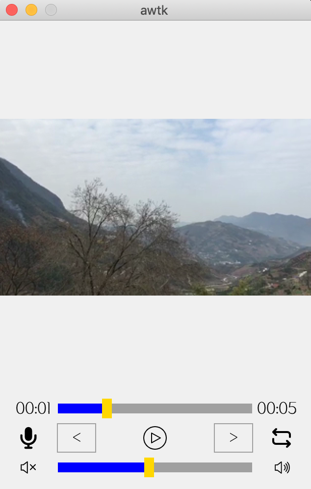
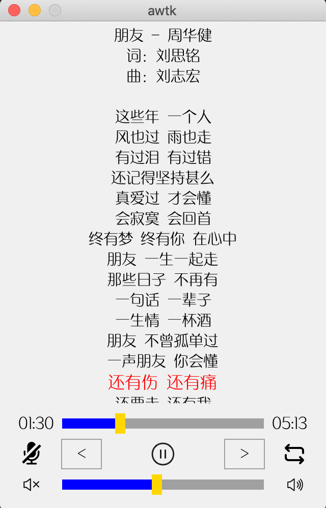

# awtk-media-player

AWTK 媒体播放器服务和相关控件。

## 1. 编译：

### 1.1. 获取 awtk 并编译

```
git clone https://github.com/zlgopen/awtk.git
cd awtk; scons; cd -
```

### 1.2. 获取 awtk-media-player 并编译

```
git clone https://github.com/zlgopen/awtk-media-player.git
cd awtk-media-player
```

#### 1.2.1 生成资源

```
python ./scripts/update_res.py all
```

> 或者通过 designer 生成资源


#### 1.2.2 编译PC版本

```
scons
```

#### 1.2.3 编译LINUX FB版本

```
scons LINUX_FB=true
```

> 完整编译选项请参考[编译选项](https://github.com/zlgopen/awtk-widget-generator/blob/master/docs/build_options.md)

> 目前仅仅支持 macos 和 linux

#### 1.2.4 编译arm-linux的alas lib

对于arm-linux，需要在编译项目之前，自己编译alsa lib。先设置arm-linux-gcc的路径到PATH中，然后执行下面的命令。

```
cd 3rd/alsa-lib/
./configure --prefix="$PWD/../../usr" --disable-shared --target=arm-linux --host=arm-linux
make V=1
make install
```

> 请根据工具链的前缀自行调整参数。

#### 1.2.5 去掉 ffmpeg

如果不需要视频播放器，可以去掉ffmpeg相关的东西: 修改SConstruct，将环境变量WITH\_FFMPEG设置为false，然后重新编译。

```
#os.environ['WITH_FFMPEG'] = 'true'
os.environ['WITH_FFMPEG'] = 'false'
```

## 2. 运行 Demo：

* 视频播放器演示

```
./bin/demo_media_player
```



* 音频播放器演示

```
./bin/demo_audio_player
```



## 3. 文档

[架构介绍](docs/arch.md)

## 4.TODO

* 优化完善。
* 移植 ffmpeg 到 Windows
* 移植 ffmpeg 到 aworks
* 基于 aworks 实现 audio device。

