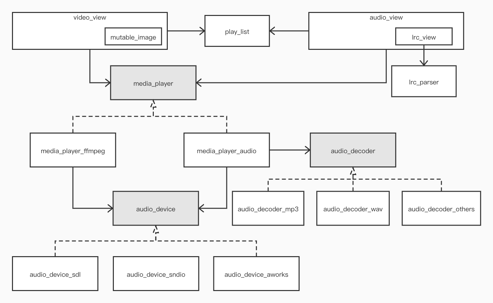

# 媒体播放器

## 1.组件框图



## 2.视图


### 2.1 概述

视图主要负责用户界面的呈现，提供播放、暂停、曲目切换、音量调节、 歌词、视频图像、进度展示和调节等图形组件。

如：

* 音频播放器 demo 的界面


* 视频播放器 demo 的界面


以上界面看起来有点朴素，不过没有关系，video\_view 和 audio\_view 并不负责呈现效果，你完全可以对界面进行任意定制。video\_view 和 audio\_view 只是负责对子控件的功能进行协调，子控件需要按特定规则进行命名：

* "lrc" 用于显示歌词，缺省使用 lrc_view 控件。如果使用自定义控件，需要支持属性 WIDGET\_PROP\_VALUE，用于设置已经播放的时间(ms)。需要支持属性 WIDGET\_PROP\_LRC 用于设置歌词对象。

* "mute" 静音开关控件。
* "mode" 播放列表循环模式控件。
* "play" 播放/暂停控件。
* "prev" 前一曲目控件。
*  "next" 下一曲目控件。
* "title" 歌曲名称控件。
* "author" 歌曲作者控件。
* "volume" 音量调节控件。
* "elapsed" 已播放时间控件。
* "duration" 曲目时间控件。
* "progress" 进度显示与调节控件。
* "mutable_image" 视频图像显示控件。

控件的位置、显示风格和层级关系可以开发者行决定，也可以在其中放其它控件，与开发其它 AWTK 应用程序没有差别。


### 2.2 video_view

除了 mutable\_image 在 video\_view 中用于显示图像，其它和 audio\_view 基本一样。如：

```xml
<window anim_hint="htranslate" theme="player">
  <video_view x="0" y="0" w="100%" h="100%">
    <mutable_image name="mutable_image" x="0" y="0" w="100%" h="-100"/>
  <column children_layout="default(r=3,c=1)" x="center" y="bottom:10" w="90%" h="90">
    <row>
      <label name="elapsed" x="0" y="middle" w="40" h="20" text="00:00"/>
      <slider name="progress" x="center" y="middle" w="-80" h="20"/>
      <label name="duration" x="right" y="middle" w="40" h="20" text="10:00"/>
    </row>
    <row>
      <check_button name="mute" style="mute" x="0" y="middle" w="30" h="30"/>
      <button name="prev" text="<" x="center:-80" y="middle" w="40" h="30"/>
      <check_button name="play" style="play" x="center" y="middle" w="40" h="30"/>
      <button name="next" text=">" x="center:80" y="middle" w="40" h="30"/>
      <image_value  name="mode" x="right" y="middle" w="30" h="30"
        value="0" image="mode_" click_add_delta="1" min="0" max="2"/>
    </row>
    <row>
      <image name="sound_minus" image="sound_minus" x="0" y="middle" w="30" h="30"/>
      <slider name="volume" max="128" value="60" x="40" y="middle" w="-80" h="20"/>
      <image name="sound_plus" image="sound_plus" x="right" y="middle" w="30" h="30"/>
    </row>
  </column>
  </video_view>
</window>
```

### 2.3 audio_view

除了 lrc\_view 在 video\_view 中用于显示歌词外，其它和 video\_view 基本一样。如：

```xml
<window anim_hint="htranslate" theme="player">
  <video_view x="0" y="0" w="100%" h="100%">
    <lrc_view name="lrc" x="0" y="0" w="100%" h="-100"/>

    <label name="author" style="author" text="" x="right:10" y="10" w="100" h="30"/>
    <label name="title" style="title" text="" x="right:10" y="40" w="100" h="30"/>
    
  <column children_layout="default(r=3,c=1)" x="center" y="bottom:10" w="90%" h="90">
    <row>
      <label name="elapsed" x="0" y="middle" w="40" h="20" text="00:00"/>
      <slider name="progress" x="center" y="middle" w="-80" h="20"/>
      <label name="duration" x="right" y="middle" w="40" h="20" text="10:00"/>
    </row>
    <row>
      <check_button name="mute" style="mute" x="0" y="middle" w="30" h="30"/>
      <button name="prev" text="<" x="center:-80" y="middle" w="40" h="30"/>
      <check_button name="play" style="play" x="center" y="middle" w="40" h="30"/>
      <button name="next" text=">" x="center:80" y="middle" w="40" h="30"/>
      <image_value  name="mode" x="right" y="middle" w="30" h="30"
        value="0" image="mode_" click_add_delta="1" min="0" max="2"/>
    </row>
    <row>
      <image name="sound_minus" image="sound_minus" x="0" y="middle" w="30" h="30"/>
      <slider name="volume" max="128" value="60" x="40" y="middle" w="-80" h="20"/>
      <image name="sound_plus" image="sound_plus" x="right" y="middle" w="30" h="30"/>
    </row>
  </column>
  </video_view>
</window>
```

### 2.4 lrc_view

lrc_view 是一个歌词显示控件。它提供如下功能：

* 显示歌词
* 高亮当前歌词
* 点击歌词触发 value changed 事件，以便定位到歌曲指定位置。

> 以上控件在src/media_player/widgets目录下

## 3.媒体播放器

### 接口

[media_player](https://github.com/zlgopen/awtk-media-player/blob/master/src/media_player/base/media_player.h) 提供了一个用于播放视频和音频文件的接口：

```c
/**
 * @class media_player_t
 * 媒体播放器接口。
 */
struct _media_player_t {
  const media_player_vtable_t* vt;

  /**
   * @property {void*} user_data
   * @annotation ["readable"]
   * 用户数据。
   */
  void* user_data;

  /*private*/
  void* on_event_ctx;
  event_func_t on_event;
};

/**
 * @method media_player_set_prop
 * 设置指定属性的值。
 *
 * > 具体实现可能提供了一些特定的属性，以通过本函数进行设置。
 * 
 * @param {media_player_t*} player media player对象。
 * @param {const char*} name 属性的名称。
 * @param {value_t*} value 属性的值。
 *
 * @return {ret_t} 返回RET_OK表示成功，否则表示失败。
 */
ret_t media_player_set_prop(media_player_t* player, const char* name, const value_t* value);

/**
 * @method media_player_get_prop
 * 获取指定属性的值。
 *
 * > 具体实现可能提供了一些特定的属性，以通过本函数进行获取。
 * 
 * @annotation ["scriptable"]
 * @param {media_player_t*} player media player对象。
 * @param {const char*} name 属性的名称。
 * @param {value_t*} value 返回属性的值。
 *
 * @return {ret_t} 返回RET_OK表示成功，否则表示失败。
 */
ret_t media_player_get_prop(media_player_t* player, const char* name, value_t* value);

/**
 * @method media_player_load
 * 加载指定的文件。
 *
 * @param {media_player_t*} media_player media_player对象。
 * @param {const char*} url URL(支持的协议与具体实现有关，缺省为本地文件)。
 *
 * @return {ret_t} 返回RET_OK表示成功，否则表示失败。
 */
ret_t media_player_load(media_player_t* player, const char* url);

/**
 * @method media_player_start
 * 开始播放刚加载或暂停的曲目。
 *
 * @param {media_player_t*} media_player media_player对象。
 *
 * @return {ret_t} 返回RET_OK表示成功，否则表示失败。
 */
ret_t media_player_start(media_player_t* player);

/**
 * @method media_player_pause
 * 暂停播放。
 *
 * @param {media_player_t*} media_player media_player对象。
 *
 * @return {ret_t} 返回RET_OK表示成功，否则表示失败。
 */
ret_t media_player_pause(media_player_t* player);

/**
 * @method media_player_stop
 * 停止播放。
 *
 * @param {media_player_t*} media_player media_player对象。
 *
 * @return {ret_t} 返回RET_OK表示成功，否则表示失败。
 */
ret_t media_player_stop(media_player_t* player);

/**
 * @method media_player_seek
 * 定位到指定的位置。
 *
 * @param {media_player_t*} media_player media_player对象。
 * @param {uint32_t} offset 偏移量(ms)。
 *
 * @return {ret_t} 返回RET_OK表示成功，否则表示失败。
 */
ret_t media_player_seek(media_player_t* player, uint32_t offset);

/**
 * @method media_player_set_volume
 * 设置音量。
 *
 * @param {media_player_t*} media_player media_player对象。
 * @param {uint32_t} volume 音量(0-100)。
 *
 * @return {ret_t} 返回RET_OK表示成功，否则表示失败。
 */
ret_t media_player_set_volume(media_player_t* player, uint32_t volume);

/**
 * @method media_player_set_muted
 * 设置静音。
 *
 * @param {media_player_t*} media_player media_player对象。
 * @param {bool_t} muted 是否静音。
 *
 * @return {ret_t} 返回RET_OK表示成功，否则表示失败。
 */
ret_t media_player_set_muted(media_player_t* player, bool_t muted);

/**
 * @method media_player_set_on_event
 * 设置事件回调函数。
 *
 * @param {media_player_t*} media_player media_player对象。
 * @param {event_func_t} on_event 事件回调函数。
 * @param {void*} ctx 事件回调函数的上下文。
 *
 * @return {ret_t} 返回RET_OK表示成功，否则表示失败。
 */
ret_t media_player_set_on_event(media_player_t* player, event_func_t on_event, void* ctx);

/**
 * @method media_player_get_video_frame
 * 获取视频的一帧图片。
 *
 * @param {media_player_t*} media_player media_player对象。
 * @param {bitmap_t*} image 用于返回图片（图片需要调用者初始化：大小和内存）。
 *
 * @return {ret_t} 返回RET_OK表示成功，否则表示失败。
 */
ret_t media_player_get_video_frame(media_player_t* player, bitmap_t* image);

/**
 * @method media_player_destroy
 * 销毁媒体播放器对象。
 *
 * @param {media_player_t*} media_player media_player对象。
 *
 * @return {ret_t} 返回RET_OK表示成功，否则表示失败。
 */
ret_t media_player_destroy(media_player_t* player);

/**
 * @method media_player_get_state
 * 获取播放状态。
 *
 * @param {media_player_t*} media_player media_player对象。
 *
 * @return {media_player_state_t} 返回播放状态。
 */
media_player_state_t media_player_get_state(media_player_t* player);

/**
 * @method media_player_get_volume
 * 获取音量。
 *
 * @param {media_player_t*} media_player media_player对象。
 *
 * @return {uint32_t} 返回音量。
 */
uint32_t media_player_get_volume(media_player_t* player);

/**
 * @method media_player_get_elapsed
 * 获取当前播放位置。
 *
 * @param {media_player_t*} media_player media_player对象。
 *
 * @return {uint32_t} 返回当前播放位置(ms)。
 */
uint32_t media_player_get_elapsed(media_player_t* player);

/**
 * @method media_player_get_duration
 * 获取时间长度。
 *
 * @param {media_player_t*} media_player media_player对象。
 *
 * @return {uint32_t} 返回时间长度(ms)。
 */
uint32_t media_player_get_duration(media_player_t* player);

/**
 * @method media_player_get_video_width
 * 获取视频宽度。
 *
 * @param {media_player_t*} media_player media_player对象。
 *
 * @return {uint32_t} 返回时间宽度(ms)。
 */
uint32_t media_player_get_video_width(media_player_t* player);

/**
 * @method media_player_get_video_height
 * 获取视频高度。
 *
 * @param {media_player_t*} media_player media_player对象。
 *
 * @return {uint32_t} 返回时间高度(ms)。
 */
uint32_t media_player_get_video_height(media_player_t* player);

/**
 * @method media_player_notify_simple
 * 事件通知。
 *
 * @param {media_player_t*} media_player media_player对象。
 * @param {uint32_t} event_type 事件类型。
 *
 * @return {ret_t} 返回RET_OK表示成功，否则表示失败。
 */
ret_t media_player_notify_simple(media_player_t* player, uint32_t event_type);

/**
 * @method media_player_notify
 * 事件通知。
 *
 * @param {media_player_t*} media_player media_player对象。
 * @param {event_t*} e 事件对象。
 *
 * @return {ret_t} 返回RET_OK表示成功，否则表示失败。
 */
ret_t media_player_notify(media_player_t* player, event_t* e);

/**
 * @method media_player_create
 * 创建media_player对象。
 *
 * @return {media_player_t*} 返回media_player对象。
 */
media_player_t* media_player_create(void);

/**
 * @method media_player
 * 获取全局缺省的media_player对象。
 *
 * @return {media_player_t*} 返回media_player对象。
 */
media_player_t* media_player(void);

/**
 * @method media_player_set
 * 设置全局缺省的media_player对象。
 *
 * @return {ret_t} 返回RET_OK表示成功，否则表示失败。
 */
ret_t media_player_set(media_player_t* media_layer);
```

播放器需要提供如下事件：

```c
/**
 * @enum media_player_event_t
 * @prefix EVT_MEDIA_PLAYER_
 * 媒体播放器的事件。
 */
typedef enum _media_player_event_t {
  /**
   * @const EVT_MEDIA_PLAYER_LOADED
   * 加载事件(media_player_loaded_event_t)。
   */
  EVT_MEDIA_PLAYER_LOADED = 1024,

  /**
   * @const EVT_MEDIA_PLAYER_PAUSED
   * 进入暂停状态。
   */
  EVT_MEDIA_PLAYER_PAUSED,

  /**
   * @const EVT_MEDIA_PLAYER_RESUMED
   * 进入播放状态。
   */
  EVT_MEDIA_PLAYER_RESUMED,

  /**
   * @const EVT_MEDIA_PLAYER_DONE
   * 播放完成。
   */
  EVT_MEDIA_PLAYER_DONE,
  /**
   * @const EVT_MEDIA_PLAYER_ABORT
   * 播放取消。
   */
  EVT_MEDIA_PLAYER_ABORT
} media_player_event_t;
```

### 3.1 基于 ffmpeg 实现的视频播放器

基于 ffmpeg 实现的视频播放器支持音频和视频播放。ffmpeg 需要自己移植到自己的平台，支持的格式和协议有自己进行配置。

请参考：[src/media\_player/ffmpeg](https://github.com/zlgopen/awtk-media-player/tree/master/src/media_player/ffmpeg)

### 3.2 基于 minimp3实现的音频播放器

基于 minimp3实现的音频播放器，支持 mp3 文件的播放。如果需要支持其它格式，可以自己实现 audio\_decoder 接口。并注册到audio\_decoder\_factory 中。

```c
/**
 * @class audio_decoder_t
 * 音频格式解码器接口。
 */
struct _audio_decoder_t {
  const audio_decoder_vtable_t* vt;

  /**
   * @property {uint32_t} position 
   * @annotation ["readable"]
   * 当前解码位置(ms)。
   */
  uint32_t position;

  /**
   * @property {uint32_t} duration
   * @annotation ["readable"]
   * 时间长度(ms)。
   */
  uint32_t duration;

  /**
   * @property {int32_t} freq
   * @annotation ["readable"]
   * 每秒采样数量。
   */
  int32_t freq;

  /**
   * @property {uint32_t} format
   * @annotation ["readable"]
   * 音频格式。
   */
  uint32_t format;

  /**
   * @property {uint8_t} channels
   * @annotation ["readable"]
   * 通道数。1表示单声道，2表示立体声。
   */
  uint8_t channels;

  /**
   * @property {uint32_t} samples
   * @annotation ["readable"]
   * 总采样数。
   */
  uint32_t samples;
};

/**
 * @method audio_decoder_decode
 * 解码数据。
 *
 * @param {audio_decoder_t*} audio_decoder audio_decoder对象。
 * @param {void*} buff 返回解码的数据。
 * @param {uint32_t} size buff的大小。
 *
 * @return {int32_t} 返回实际数据的长度。
 */
int32_t audio_decoder_decode(audio_decoder_t* decoder, void* buff, uint32_t size);

/**
 * @method audio_decoder_seek
 * 定位到指定的位置。
 *
 * @param {audio_decoder_t*} decoder audio_decoder对象。
 * @param {uint32_t} offset 绝对偏移量(ms)。
 *
 * @return {ret_t} 返回RET_OK表示成功，否则表示失败。
 */
ret_t audio_decoder_seek(audio_decoder_t* decoder, uint32_t offset);

/**
 * @method audio_decoder_destroy
 * 销毁audio decoder对象。
 *
 * @param {audio_decoder_t*} decoder audio_decoder对象。
 *
 * @return {ret_t} 返回RET_OK表示成功，否则表示失败。
 */
ret_t audio_decoder_destroy(audio_decoder_t* decoder);
```

请参考：[src/media\_player/audio\_player](https://github.com/zlgopen/awtk-media-player/tree/master/src/media_player/audio_player)

## 4. 音频设备以及移植

音频设备是平台相关的，这里参照 SDL Audio 抽象了 audio device 接口。

```c

/**
 * @class audio_device_t
 * 音频设备接口。
 */
struct _audio_device_t {
  const audio_device_vtable_t* vt;

  /**
   * @property {uint32_t} volume
   * @annotation ["readable"]
   * 音量。
   */
  uint32_t volume;

  /*private*/
  audio_spec_t spec;
};

/**
 * @method audio_device_mix
 * 准备播放的数据(在回调函数中调用)。
 *
 * @param {audio_device_t*} device audio_device对象。
 * @param {uint8_t*} dst 目标缓存区。
 * @param {const uint8_t*} src 目标缓存区。
 * @param {uint32_t} len 数据长度。
 *
 * @return {ret_t} 返回RET_OK表示成功，否则表示失败。
 */
ret_t audio_device_mix(audio_device_t* device, uint8_t* dst, const uint8_t* src, uint32_t len);

/**
 * @method audio_device_dequeue_data
 * 获取录音的数据。
 *
 * @param {audio_device_t*} device audio_device对象。
 * @param {void*} data 用于返回数据。
 * @param {uint32_t} len 最大数据长度。
 *
 * @return {uint32_t} 返回实际数据长度。
 */
uint32_t audio_device_dequeue_data(audio_device_t* device, void* data, uint32_t len);

/**
 * @method audio_device_queue_data
 * 追加播放的音频数据。
 *
 * @param {audio_device_t*} device audio_device对象。
 * @param {const void*} data 音频数据。
 * @param {uint32_t} len 数据长度。
 *
 * @return {int32_t} 返回实际数据长度。
 */
int32_t audio_device_queue_data(audio_device_t* device, const void* data, uint32_t len);

/**
 * @method audio_device_get_queued_data_size
 * 获取队列中的音频数据长度。
 *
 * @param {audio_device_t*} device audio_device对象。
 *
 * @return {uint32_t} 返回数据长度。
 */
uint32_t audio_device_get_queued_data_size(audio_device_t* device);

/**
 * @method audio_device_clear_queued_data
 * 清除队列中的音频数据。
 *
 * @param {audio_device_t*} device audio_device对象。
 *
 * @return {ret_t} 返回RET_OK表示成功，否则表示失败。
 */
ret_t audio_device_clear_queued_data(audio_device_t* device);

/**
 * @method audio_device_start
 * 让设备开始工作。
 *
 * @param {audio_device_t*} audio_device audio_device对象。
 *
 * @return {ret_t} 返回RET_OK表示成功，否则表示失败。
 */
ret_t audio_device_start(audio_device_t* device);

/**
 * @method audio_device_pause
 * 让设备暂停工作。
 *
 * @param {audio_device_t*} audio_device audio_device对象。
 *
 * @return {ret_t} 返回RET_OK表示成功，否则表示失败。
 */
ret_t audio_device_pause(audio_device_t* device);

/**
 * @method audio_device_set_volume
 * 设置音量。
 *
 * @param {audio_device_t*} device audio_device对象。
 * @param {uint32_t} volume 音量(0-100)。
 *
 * @return {ret_t} 返回RET_OK表示成功，否则表示失败。
 */
ret_t audio_device_set_volume(audio_device_t* device, uint32_t volume);

/**
 * @method audio_device_destroy
 * 销毁audio device对象。
 *
 * @param {audio_device_t*} device audio_device对象。
 *
 * @return {ret_t} 返回RET_OK表示成功，否则表示失败。
 */
ret_t audio_device_destroy(audio_device_t* device);

/**
 * @method audio_device_mixer_create
 * 创建用于播放的音频设备。
 *
 * @param {const char*} name 名称。
 * @param {const audio_spec_t*} desired 期望的audio spec。
 * @param {audio_spec_t*} real 实际支持的audio spec。
 *
 * @return {audio_device_t*} 返回音频设备。
 */
audio_device_t* audio_device_mixer_create(const char* name, const audio_spec_t* desired,
                                          audio_spec_t* real);

/**
 * @method audio_device_recorder_create
 * 创建用于录音的音频设备。
 *
 * @param {const char*} name 名称。
 * @param {const audio_spec_t*} desired 期望的audio spec。
 * @param {audio_spec_t*} real 实际支持的audio spec。
 *
 * @return {audio_device_t*} 返回音频设备。
 */
audio_device_t* audio_device_recorder_create(const char* name, const audio_spec_t* desired,
                                             audio_spec_t* real);
```

目前提供了基于 SDL 实现 audio device，后续根据需求加入其它平台支持。

请参考：[media\_player/audio\_device/sdl](https://github.com/zlgopen/awtk-media-player/tree/master/src/media_player/audio_device/sdl)


